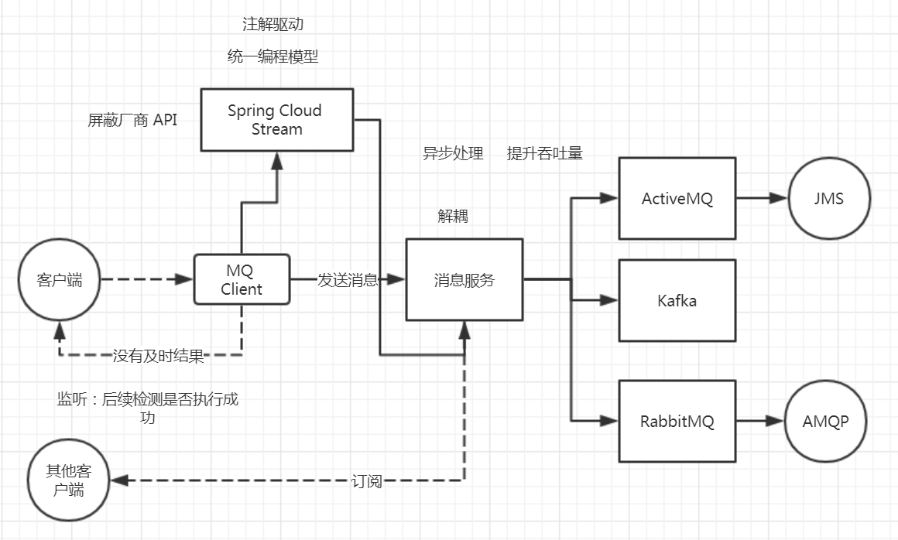
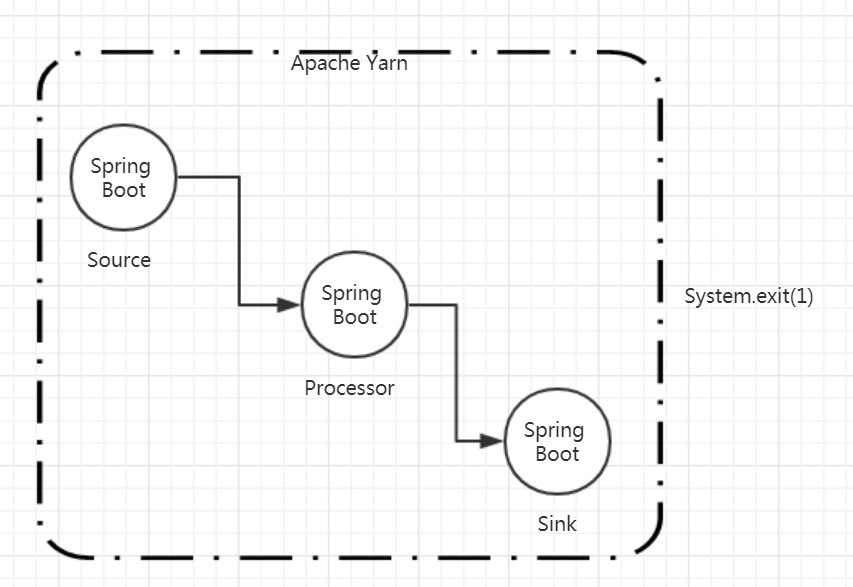

# 第十三节 Spring Cloud Stream 整合


## 遗留问题

指导文章 https://docs.oracle.com/javase/tutorial/reflect/member/methodparameterreflection.html

Java 8+ 增加 `javac` `-parameters` 参数

> 大前提：必须是 Java 8


如果不增加参数的话，`-parameters` 编译参数，`Parameter#getName()` 方法 “arg0”

为什么 Spring  `DefaultParameterNameDiscoverer` 返回 null


## 去年 Spring Cloud Stream 整合 Kafka


## 相关技术 




###  Reactive Streams

`Publisher`

`Subscriber`

`Processor`


元编程：基于编程的编程、Reflection、Function、Lambda、表达式语言


```java
        Stream
                .of(1, 2, 3, 4, 5)                         // 生产
                .map(String::valueOf)               // 处理
                .forEach(System.out::println);  // 消费

```

`${user.age}`


### Spring Cloud Data Flow




## 主要内容


### Spring Cloud Stream 整合 RabbitMQ


#### 增加依赖


```xml
<dependency>
    <groupId>org.springframework.cloud</groupId>
    <artifactId>spring-cloud-stream-binder-rabbit</artifactId>
</dependency>
<dependency>
  <groupId>org.springframework.cloud</groupId>
  <artifactId>spring-cloud-starter-stream-rabbit</artifactId>
</dependency>
```


##### 分析依赖

间接依赖 

* Spring Integration，相关文档:https://docs.spring.io/spring-integration/docs/5.0.7.RELEASE/reference/html/amqp.html
* Spring Message
* Spring AMQP
  * RabbitMQ
  * `RabbitTemplate` 自动装配
  * 


#### 配置项

`RabbitBindingProperties`


> 小技巧：
>
> Spring *Template 实现 *Operations
>
> JdbcTemplate
>
> RedisTemplate
>
> **RabbitTemplate**
>
> KafkaTemplate
>
> RestTemplate


#### 务必在消息处理中做幂等性处理

```java
    @Autowired
    private SimpleMessageReceiver simpleMessageReceiver;

	@PostConstruct
    public void init() {  // 接口编程
        // 获取 SubscribableChannel
        SubscribableChannel subscribableChannel = simpleMessageReceiver.gupao();
        subscribableChannel.subscribe(message -> {
            MessageHeaders headers = message.getHeaders();
            String encoding = (String) headers.get("charset-encoding");
            String text = (String) headers.get("content-type");
            byte[] content = (byte[]) message.getPayload();
            try {
                System.out.println("接受到消息：" + new String(content, encoding));
            } catch (UnsupportedEncodingException e) {
                e.printStackTrace();
            }
        });
    }

    @StreamListener("gupao2018")  // Spring Cloud Stream 注解驱动
    public void onMessage(byte[] data) {
        System.out.println("onMessage(byte[]): " + new String(data));
    }

    @StreamListener("gupao2018")  // Spring Cloud Stream 注解驱动
    public void onMessage(String data) {
        System.out.println("onMessage(String) : " + data);
    }

    @StreamListener("gupao2018") // Spring Cloud Stream 注解驱动
    public void onMessage2(String data2) {
        System.out.println("onMessage2(String) : " + data2);
    }

    @ServiceActivator(inputChannel = "gupao2018") // Spring Integration 注解驱动
    public void onServiceActivator(String data) {
        System.out.println("onServiceActivator(String) : " + data);
    }
```

> 注意：相同的编程模型重复执行，例如 `@StreamListener`，不同的编程模型轮流执行


## 下节预习

### 去年 VIP Spring Cloud [第九节 Spring Cloud Stream (下)](http://git.gupaoedu.com/vip/xiaomage-space/tree/master/VIP%E8%AF%BE/spring-cloud/lesson-9)


