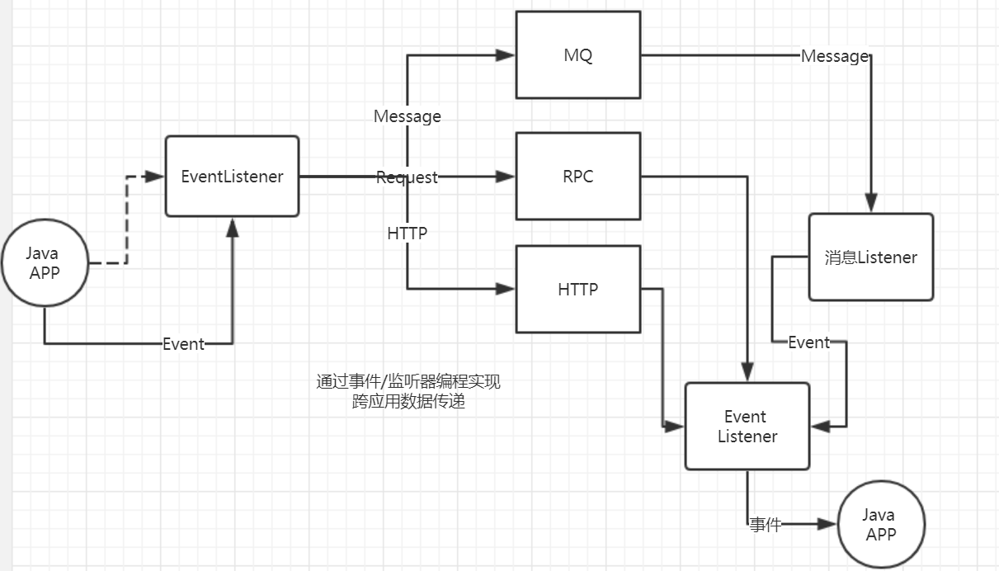
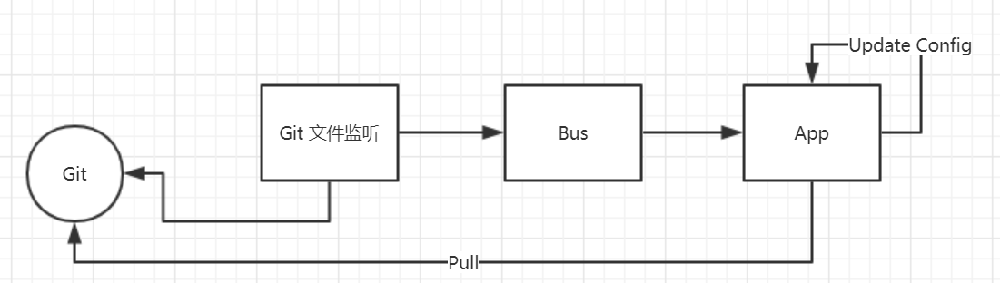
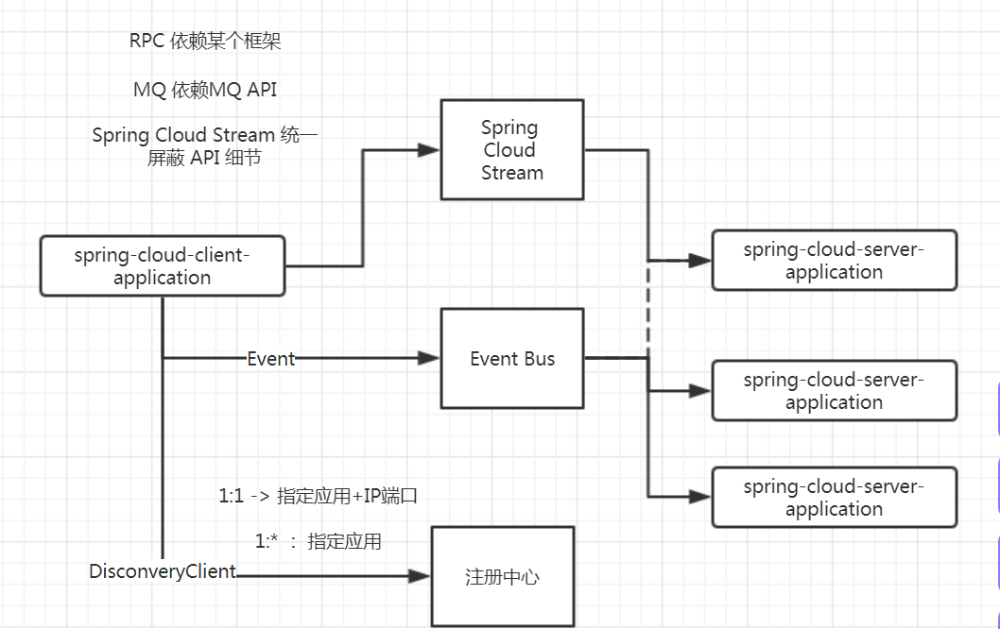
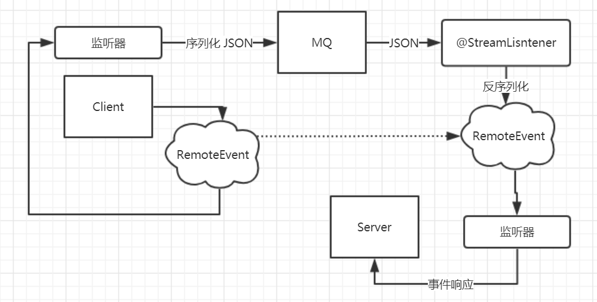

# 第十四节 Spring Cloud Bus


## 知识回顾和发散


### Java 事件/监听者模式


#### 事件

* 所有事件类型扩展 `java.util.Event`
* 每个事件对象都有事件源


#### 事件监听器

* 事件监听器接口扩展 `java.util.EventListener`

* 方法参数类型

  *  `java.util.Event` 对象（子类）
  * 事件源
    * JPA `EntityListener`
      * `@Entity`
      * `EntityManager` persist(Object)

* 监听方法访问限定符 `public`

* 监听方法是没有返回值（`void`）

  * 例外：Spring `@EventListener`

* 监听方法不会 `throws` `Throwable`

  

##### 多事件监听器接口

限制：Java 8 之前，接口没有 `default` method，当出现多个监听方法时，需要 `Adapter` 抽象类提供空实现。

* Adapter 
  * 接口空实现
  * A 和 B 两种没有层次关系，A 适配为 B

> 注意：事件/监听者器，尤其在扩展时，注意事件（语法）时态。


####  举例说明：GUI 桌面程序

```java
public class GUIEvent {

    public static void main(String[] args) throws Exception {

        final JFrame frame = new JFrame("简单 GUI 程序 - Java 事件/监听机制");

        frame.addMouseListener(new MouseAdapter() {
            @Override
            public void mouseClicked(MouseEvent event) {
                System.out.printf("[%s] 事件 : %s\n", Thread.currentThread().getName(), event);
            }
        });

        frame.setBounds(300, 300, 400, 300);

        frame.setVisible(true);

        frame.addWindowListener(new WindowAdapter() {
            @Override
            public void windowClosing(WindowEvent e) {
                frame.dispose();
            }

            @Override
            public void windowClosed(WindowEvent event) {
                System.exit(0);
            }
        });

    }
}
```


###  Spring 事件


#### Spring 事件

Spring 事件基类 `ApplicationEvent`

* 相对于 `java.util.EventObject` 增加事件发生时间戳
  * `timestamp`


##### 内建事件

`ContextRefreshedEvent `

* `ConfigurableApplicationContext#refresh()`

`ContextClosedEvent `

* `ConfigurableApplicationContext#close()`

`ContextStartedEvent `

* `ConfigurableApplicationContext#start()`

`ContextStoppedEvent `

* `ConfigurableApplicationContext#stop()`

`RequestHandledEvent `

* `FrameworkServlet#publishRequestHandledEvent`

> 注意：事件/监听者器，注意事件（语法）时态。


#### Spring 事件监听器

所有 Spring 事件监听器实现 `ApplicationListener`


### Spring Boot 事件


### Spring Cloud 事件


### Event Bus（事件总线）


## 主要内容


### 总体架构




### Git 配置更新 Bus 架构




### Spring Cloud Bus 事件

`RemoteApplicationEvent`







通过 Spring 事件/监听者编程模型，屏蔽了事件源传输的细节，可能是 MQ、RPC 或 HTTP 等。


## 下节预习

### 去年 VIP Spring Cloud [第九节 Spring Cloud Stream (下)](http://git.gupaoedu.com/vip/xiaomage-space/tree/master/VIP%E8%AF%BE/spring-cloud/lesson-9)


