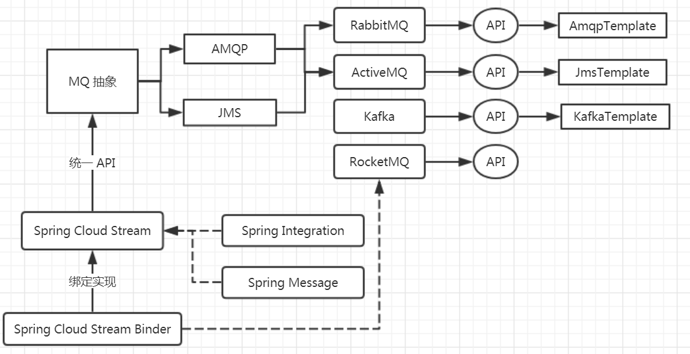

# 第十五节 Spring Cloud Stream Binder


## 知识回顾和发散

Apache RocketMQ


## 主要内容


### Spring Cloud Stream 以及 Binder 架构




### 参考 Spring Cloud Stream Binder 已有实现


#### 参考 Spring Cloud Stream 文档


##### Binder 实现步骤

A typical binder implementation consists of the following:

- A class that implements the `Binder` interface; （实现 `Binder`  接口）

- A Spring `@Configuration` class that creates a bean of type `Binder` along with the middleware connection infrastructure.（`Binder` 实现类上标注 `@Configuration` 注解）

- A `META-INF/spring.binders` file found on the classpath containing one or more binder definitions, as shown in the following example:（`META-INF/spring.binders`  配置 `Binder` 名称和 `Binder` 实现自动装配类映射）

  ```
  kafka:\
  org.springframework.cloud.stream.binder.kafka.config.KafkaBinderConfiguration
  ```


思考：假设有多个 Binder 实现 jar 同时存在，那么采用哪个呢？

* 配置默认 Binder 名称

```properties
spring.cloud.stream.defaultBinder = rabbit
```

* 指定某种 Binder 实现

```properties
spring.cloud.stream.bindings.input.binder=kafka
spring.cloud.stream.bindings.output.binder=rabbit
```


#### 参考 Spring Cloud Stream Binder RabbitMQ


#### 参考 Spring Cloud Stream Binder Kafka（自习）


### 实现 Spring Cloud Stream Binder RocketMQ


RocketMQ -> 发消息、收消息

bindProducer  发消息

bindConsumer 收消息


#### 预备工作

1. 下载 RocketMQ
2. 启动命名服务器
3. 启动 MQ 代理


#### 实现步骤

* 创建 `spring-cloud-stream-binder-rocketmq` 工程

```xml
    <groupId>com.gupao</groupId>
    <artifactId>spring-cloud-stream-binder-rocketmq</artifactId>
    <version>0.0.1-SNAPSHOT</version>
```


* 增加  Spring Cloud Stream Binder 依赖

* 增加 RocketMQ Client 依赖

```xml
        <dependency>
            <groupId>org.apache.rocketmq</groupId>
            <artifactId>rocketmq-client</artifactId>
            <version>4.3.0</version>
        </dependency>
```


#### Spring Cloud Stream Binder For RocketMQ Starter

`spring-cloud-stream-binder-rocketmq`


