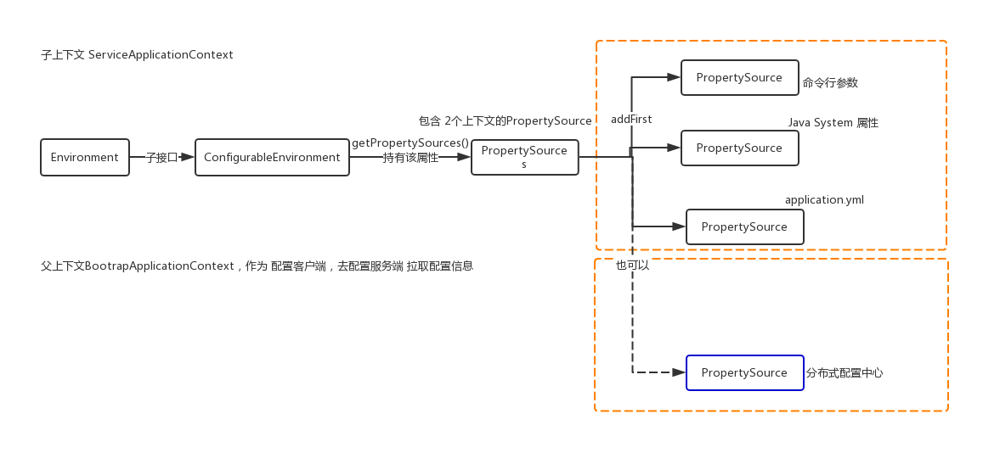

# 第七节 Spring Cloud 配置管理
## 分布式配置
### 国内知名开源项目
> * 百度 Disconf，携程 Apollo，阿里 Nacos
### 国外知名开源项目
> * Spring Cloud Config，Netfix Archaius，Apache Zookeeper
### 客户端
> * 一般：配置客户端 → HTTP1.1 Pull → 配置服务端； HTTP1.1特点：无状态短连接；
> * springcloud：配置客户端 → 启动服务时加载 通过 HTTP1.1 Pull → 配置服务端 → git/本地文件file/DB；
> * Java Client自行读取 HttpClient；Apache Commons Configuration；
##### Spring Environment

#### 创建 spring-cloud-config-client，从 配置中心，获取自己的配置文件
> * 配置三方库 `commons-configuration`
> * `org.apache.commons.configuration.Configuration` : 提供大多数常见类型的 Value 转换，其派生类 如下，Configuration表示接口，各实现类表示各种不同的来源
  * `PropertiesConfiguration`: 将 Properties 作为 `Configuration` 数据来源
  * `MapConfiguration`
    * `EnvironmentConfiguration` ： 将 OS环境变量 作为 `Configuration` 数据来源；
    * `SystemConfiguration` : 将 Java 系统属性 作为 `Configuration` 数据来源；
  * `CompositeConfiguration` ： 将各种配置源数据 封装到 Configuration，然后根据key获取 配置的值value；
> * 小结：org.apache.commons.configuration.Configuration整合配置方式：配置源(存储媒介决定读取方式)，配置源顺序(决定配置优先级覆盖)，转换类型(提高 编程 便利性)；
spring-cloud-config-client项目的 pom.xml 引入依赖
```xml
    <dependency>
        <groupId>commons-configuration</groupId>
        <artifactId>commons-configuration</artifactId>
        <version>1.9</version>
    </dependency>
```
> * HTTP资源 算不算一个配置源？提到资源必须注意，具体如下：
> * 资源 包括 文件，HTTP资源，jdbc资源，Git；这些归根结底都是 URL；URL -> file:/// , http://, jdbc:// , git://；小结：所有资源 都是 URL；
> * HTTP里面 存在不存在 PULL 给客户端？websocket也可以这么做，但是 客户端实现比较麻烦，java有很多websocket客户端，大多数通过浏览器实现，因为
浏览器第一次访问时，用http访问，然后进行协议转换，从http协议转换为 websocket协议，怎么和spring整合的呢？
> * spring整合配置方式：配置源(存储媒介决定读取方式)，配置源顺序(决定配置优先级覆盖)，转换类型(提高 编程 便利性)；与apache-commons不同的是，spring
使用 Environment接口，具体如下；
```sequence
Environment ← ConfigurableEnvironment 父接口 子接口：
ConfigurableEnvironment持有 可变配置源MutablePropertySources； 
MutablePropertySources持有 List<PropertySource<?>> propertySourceList 属性 : MutablePropertySources 包含多个 PropertySource
```

> * `PropertySource` 表示 资源 有如下 子类，注意：按从上到下的顺序，依次加载资源：
* `MapPropertySource`
  * `PropertiesPropertySource`：将Properties文件资源URL 封装到 PropertiesPropertySource中；
* `CompositePropertySource` : 持有Set<PropertySource<?>> propertySources 组合了多种PropertySource，将多种资源URL 读取到CompositePropertySource
* `SystemEnvironmentPropertySource`：将 环境变量类型的资源URL 封装到SystemEnvironmentPropertySource；
* 重点：也可以弄一个 XxxPropertySource：将 配置中心的资源URL 封装到XxxPropertySource中，并且 XxxPropertySource第一个存到MutablePropertySources
的propertySourceList中，加载到第一个 PropertySource后，后面的就不会再加载了；
> * AbstractApplicationContext类设置 父上下文时，要合并 父上下文的环境ConfigurableEnvironment，AbstractApplicationContext是一个抽象类，不能实例化，
当调用其 setParent(ApplicationContext parent)时，相当于调用其实现子类的setParent()方法，代码如下：
```java
public abstract class AbstractApplicationContext extends DefaultResourceLoader implements ConfigurableApplicationContext, DisposableBean {
    @Override
    public void setParent(ApplicationContext parent) {
        this.parent = parent;
        if (parent != null) {
            Environment parentEnvironment = parent.getEnvironment();
            if (parentEnvironment instanceof ConfigurableEnvironment) {
                getEnvironment().merge((ConfigurableEnvironment) parentEnvironment);
            }
        }
    }
}
```
Spring Cloud 客户端配置定位扩展 : `PropertySourceLocator`

### 创建 spring-cloud-config-server 作为配置服务端，既然是服务端，就有HTTP端点 endpoint，配置客户端 向 配置服务端 请求配置信息，配置服务端再 向配置中心 请求配置信息
> * pom.xml 只依赖 spring-cloud-config-server
```xml
    <dependency>
        <groupId>org.springframework.cloud</groupId>
        <artifactId>spring-cloud-config-server</artifactId>
    </dependency>
```
 * 创建 resources/configs/config.properties为 本地git仓库，模拟 配置中心，并启动 项目，模拟配置客户端 请求spring-cloud-config-server，获取配置信息；
```properties
spring.application.name = config-server
server.port = 10086
## 配置服务器 git 本地文件系统路径，并在configs目录下设置git环境：git init; git commit -a -m config.properties;
spring.cloud.config.server.git.uri = \
${user.dir}/spring-cloud-project/spring-cloud-config-server/src/main/resources/configs/
```
> * 请求http://localhost:10086/config/default 获取 config.properties配置文件
> * 请求http://localhost:10086/config/test 获取 config-test.properties配置文件

#### 服务端基于 Git 实现，实际是基于版本化配置
> * 三段式：/应用名/profile/${label}，其中label指分支

/应用名/profile/ = /应用名/profile/master

/应用名/ = /应用名.properties


Spring Cloud Config 实现一套完整的配置管理 API 设计

Git 实现缺陷：

* 复杂的版本更新机制（ Git 仓库）
  * 版本
  * 分支
  * 提交
  * 配置
* 憋足的内容更新（实时性不高）
  * 客户端第一次启动拉取
  * 需要整合 BUS 做更新通知
#### 设计原理

##### 分析 `@EnableConfigServer`

```java
@Target(ElementType.TYPE)
@Retention(RetentionPolicy.RUNTIME)
@Documented
@Import(ConfigServerConfiguration.class)
public @interface EnableConfigServer {

}
```

实际配置类 `ConfigServerConfiguration`

```java
@Configuration
public class ConfigServerConfiguration {
	class Marker {}

	@Bean
	public Marker enableConfigServerMarker() {
		return new Marker();
	}
}
```

```java
@Configuration
@ConditionalOnBean(ConfigServerConfiguration.Marker.class)
@EnableConfigurationProperties(ConfigServerProperties.class)
@Import({ EnvironmentRepositoryConfiguration.class, CompositeConfiguration.class, ResourceRepositoryConfiguration.class,
		ConfigServerEncryptionConfiguration.class, ConfigServerMvcConfiguration.class })
public class ConfigServerAutoConfiguration {

}
```
当应用配置类标注了
*  `@EnableConfigSever` 
  * 导入 `ConfigServerConfiguration`
    * 注册 `Marker` Bean
      * 作为 `ConfigServerAutoConfiguration` 条件之一
##### 案例分析 JDBC 实现
* JdbcTemplate Bean 来源

  * `JdbcTemplateAutoConfiguration`

* SQL 来源

  * `JdbcEnvironmentProperties`

    * `spring.cloud.config.server.jdbc.sql` 

      * 不配置，默认：`DEFAULT_SQL`

        * ```sql
          SELECT KEY, VALUE from PROPERTIES where APPLICATION=? and PROFILE=? and LABEL=?
          ```

| KEY  | VALUE      | APPLICATION | PROFILE | LABEL  |
| ---- | ---------- | ----------- | ------- | ------ |
| name | mercyblitz | config      | default | master |
| name | xiaomage   | config      | test    | master |
|      |            |             |         |        |

本质说明：
JDBC 连接技术
DB 存储介质
`EnvironmentRepository` 核心接口
思考是否可以自定义 `EnvironmentRepository`  实现？
前提：如何激活自定义的 `EnvironmentRepository`  实现
找到了为什么默认是 Git 作为配置仓库的原因：
```java
@Configuration
@ConditionalOnMissingBean(value = EnvironmentRepository.class, search = SearchStrategy.CURRENT)
class DefaultRepositoryConfiguration {
	...
	@Bean
	public MultipleJGitEnvironmentRepository defaultEnvironmentRepository(
	        MultipleJGitEnvironmentRepositoryFactory gitEnvironmentRepositoryFactory,
			MultipleJGitEnvironmentProperties environmentProperties) throws Exception {
		return gitEnvironmentRepositoryFactory.build(environmentProperties);
	}
}
```
当 Spring 应用上下文没有出现 `EnvironmentRepository` Bean 的时候，那么，默认激活 `DefaultRepositoryConfiguration` (Git 实现)，否则采用自定义实现。
#### 自定义实现
自定义 `EnvironmentRepository` Bean
```java
    @Bean
    public EnvironmentRepository environmentRepository() {
        return (String application, String profile, String label) -> {
            Environment environment = new Environment("default", profile);
            List<PropertySource> propertySources = environment.getPropertySources();
            Map<String, Object> source = new HashMap<>();
            source.put("name", "小马哥");
            PropertySource propertySource = new PropertySource("map", source);
            // 追加 PropertySource
            propertySources.add(propertySource);
            return environment;
        };
    }
```
以上实现将失效 `DefaultRepositoryConfiguration` 装配。
#### HTTP 请求模式
/${application}/$${profile}/$${label}

`@Controller` 或者 `@RestController`

@RequestMapping("/{application}/{profile}/{label}")
/config/test/master
config : application
test : profile
master : label

#### 比较 Spring Cloud 内建配置仓储的实现

Git 早放弃

JDBC 太简单

Zookeeper 比较适合做分布式配置

自定义是高端玩家


## 下节预习

### Spring Cloud 服务发现

回顾去年 VIP

[第三节 Spring Cloud Netflix Eureka](http://git.gupaoedu.com/vip/xiaomage-space/tree/master/VIP%E8%AF%BE/spring-cloud/lesson-3)

